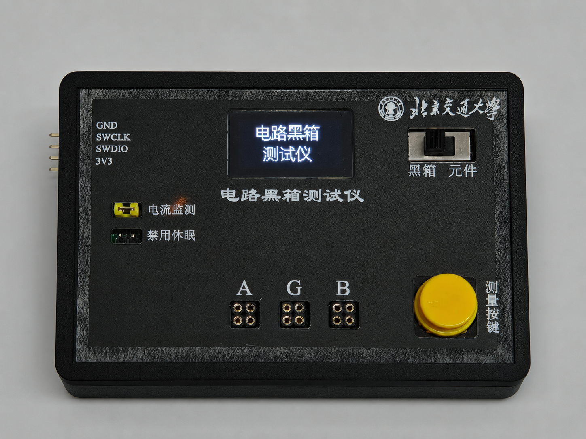

# 🚀 便携式智能电路特性测试仪 (Portable Intelligent Circuit Tester)

[](https://www.st.com/en/microcontrollers-microprocessors/stm32f407-147.html)
[](https://en.cppreference.com/)
[](https://www.keil.com/)
[](LICENSE)

这是一个基于 **STM32F407VET6** 开发的**便携式智能电路特性测试仪**开源项目。该项目是一键全自动完成“二端电路黑箱拓扑识别与参数测量”以及“独立二端元件特性测试”的智能电子测试仪器。

本项目是一套完整的硬件、软件及结构设计方案，适合电子系统设计爱好者、高校电子课设参考。

---

## 📸 实物展示 (Gallery)

### 整体外观


### 内部结构与硬件工艺
| 内部结构1 | 内部结构2 |
| :---: | :---: |
|  |  |

---

## 📂 项目目录结构 (Directory Structure)

```text
便携式电路测试仪/
├── Docs/               # 项目文档与设计图纸
│   ├── 电路原理图.pdf                   # 系统核心电路原理图
│   └── 面板.pdf                         # 亚克力外壳丝印面板设计PDF
├── Hardware/           # 硬件设计源文件 (立创EDA专业版)
│   ├── 黑箱检测仪.epro                  # 智能测试仪原理图及PCB工程
│   ├── 面板设计文件.epanm               # 亚克力前面板丝印设计源文件
│   └── PCB制板文件.zip                  # 可直接用于打样的 Gerber 生产文件
├── Simulation/         # 电路核心仿真文件 (Multisim 14)
│   ├── RC RL串联.ms14                   # RC/RL 阻抗网络基本分压仿真
│   ├── 低功耗&开关(1).ms14              # 低功耗自动开关机电路仿真
│   ├── 提高 电阻接地 C .ms14            # 提高部分：电阻接地电容幅频响应仿真
│   ├── 提高 电阻接地 L.ms14            # 提高部分：电阻接地电感幅频响应仿真
│   ├── 提高 黑箱接地 C .ms14            # 提高部分：黑箱接地电容幅频响应仿真
│   ├── 提高 黑箱接地 L.ms14            # 提高部分：黑箱接地电感幅频响应仿真
│   └── 电路仿真（频域）.ms14            # 全系统频域响应分析
├── Data/               # 实验扫频增益分析与计算数据
│   ├── 数据记录 测量仪.xlsx             # 阻抗网络在不同频点下的幅频响应实测记录
│   └── 过渡带仿真记录.xlsx              # 过渡带中点频率法参数反算仿真与误差分析
├── Firmware/           # 嵌入式源码工程 (Keil MDK-ARM)
│   └── Black Box/                      
│       ├── User/                       # 核心业务逻辑层 (已深度模块化整理)
│       │   ├── Src/                    # 算法源文件 (black_box.c, extend.c, adc_fft_rms.c)
│       │   └── Inc/                    # 头文件 (black_box.h, extend.h, adc_fft_rms.h)
│       ├── Hardware/                   # 独立硬件外设驱动层
│       │   ├── Src/                    # 驱动源文件 (ad9833.c, oled.c, gui.c, lcd_driver.c, font96.c)
│       │   └── Inc/                    # 头文件及字库
│       └── MDK-ARM/                    # Keil 编译工程目录 (TFTLCD.uvprojx)
└── README.md           # 项目开源说明文档
```

---

## 🌟 核心功能特性 (Features)

*   **一键全自动测量 (One-Key Fast Measurement)**：系统从按键启动到完成测试全程不超过5秒，零人工干预。
*   **电路黑箱测试 (Black Box Mode)**：
    *   **拓扑识别**：自动判断二端口黑箱内部结构是“纯电阻网络”、“RC串联”、“RC并联”、“RL串联”、“RL并联”还是“无黑箱”。
    *   **参数计算**：高精度解算黑箱中的固定电阻 $R$（$10\Omega \sim 10\text{k}\Omega$）以及未知元件 $X$ 的具体数值（电阻 $Rx$、电容 $Cx$ 或电感 $Lx$），计算误差均远低于工业要求。
*   **独立二端元件测试 (Component Mode)**：
    *   **元件自动分类**：自动判断待测元件是电阻、电容、电感、二极管，或开路无元件。
    *   **程控自动量程测阻**：基于 5 档分压电阻（$30.3\Omega \sim 475\text{k}\Omega$）自动量程切换，实现 $10\Omega \sim 1\text{M}\Omega$ 极宽范围的高精度电阻测量。
    *   **等效串联电阻 (ESR) 提取**：测量电容值 ($1\text{nF} \sim 100\mu\text{F}$)、电感值 ($100\mu\text{H} \sim 10\text{mH}$)，并利用双频算法剥离提取出元件的等效串联电阻（ESR，$0 \sim 30\Omega$）。
    *   **二极管特性测试**：自动识别引脚方向，限制测量电流 $<10\text{mA}$，精确测量其正向导通压降 $V_f$。
*   **电源管理与超低功耗待机**：
    *   支持单路 USB 或锂电池供电。
    *   30 秒无任何操作自动休眠关机，长按测量键 3 秒手动关机。
    *   关机待机电流不超过 **$0.1\text{mA}$**。

---

## 🛠️ 工作原理与算法实现

### 1. 频域扫频走势大类划分
利用 STM32F407 控制继电器接入 **AD9833 DDS 信号源**，程序首先在近直流低频点（$10\text{Hz}$）和高频极限点（$1.2\text{MHz}$）两处采集分压增益 $Au = V_{out} / V_{in}$。
*   **增益单调递增** ── 判定为 **RC 阻抗网络**。继电器切换参考分压电阻至 **$1020\Omega$**，启动对数扫频。
*   **增益单调递减** ── 判定为 **RL 阻抗网络**。继电器切换参考分压电阻至 **$30.5\Omega$**，启动对数扫频。
*   **增益差值 < 0.05** ── 判定为 **纯电阻网络**。

### 2. 精准过渡带截止频率解析算法
在确定阻抗网络类型后，程序控制 AD9833 生成 18 个对数分布频点进行快速扫频，并在 TFT 液晶屏上实时绘制幅频曲线。
系统提取与过渡带中点增益 $Au_{mid} = (Au_{min} + Au_{max})/2$ 最接近的实测点频点 $f_x$，带入阻抗分压公式直接求出 $C$ 或 $L$。该算法相比于传统的 $-3\text{dB}$ 截止频率点搜索法，极大地降低了对频点采样密度的依赖，测量误差从 $>20\%$ 降低到了 $\le 5\%$。

### 3. 双频率法解耦测量等效串联电阻 (ESR)
在元件模式下，对于大容量电容或损耗较大的电感，系统在过渡带内取两个相邻频点 $f_1, f_2$ 以及对应增益 $n_1, n_2$，联立复阻抗分压方程求解：
$$\text{ESR} = \sqrt{\frac{R_1^2}{n_1^2} - X_{C1}^2} - R_1$$
通过二元二次方程组直接求解出电容值 $C$ 及其等效串联电阻 (ESR)，有效抑制了损耗角正切对电容计算的影响。

---

## 🚀 关键调试挑战与优化 (Technical Highlights)

*   **DMA 采样缓存污染机制（软硬件协同调优）**：
    由于采用了定时器触发 ADC + DMA 循环缓冲采集，并直接对整个缓冲区内的数据进行均方根（RMS）计算。当扫频切换频率时，DMA 缓冲区会混合新旧两个频率的数据，导致计算的幅频曲线在过渡带产生严重畸变。项目计算出填满缓冲区所需的理论时间，在新频指令下发后加入 **$165\text{ms}$ 的延时消抖**，确保有效值计算只在新频率信号完全填满后执行，误差从 $>20\%$ 降至 **$\le 5\%$**。
*   **低功耗控制引脚电平不足兼容**：
    硬件上低功耗关机芯片的关机控制引脚需要达到 $3.5\text{V}$ 的关机电平，而 STM32 的 GPIO 输出最高为 $3.3\text{V}$ 导致无法触发关机。项目通过在软件上拉低与按键端相连的 PA0 引脚 3 秒，利用模拟物理长按按键的手法成功绕开电平限制，实现了系统待机电流 $\le 0.1\text{mA}$。

---

## 💻 固件开发与部署指南

### 1. 软件环境配置
*   **Keil uVision 5** (MDK-ARM) 开发环境。
*   安装 **Keil.STM32F4xx_DFP** 单片机支持包。

### 2. 编译烧录步骤
1.  双击打开 `Firmware/Black Box/MDK-ARM/TFTLCD.uvprojx`。
2.  在 Keil 中点击 **Rebuild**（重新构建项目，工程内已完成垃圾文件清理，一键直编译通过）。
3.  通过 SWD 调试线（ST-Link / DAP-Link）连接测试仪板载调试接口，点击 **Download** 烧录至单片机。
4.  上电复位，OLED 屏幕播放开机动画后即可开始使用。

---

## 🤝 贡献与致谢
*   非常感谢另外两位成员在本项目开发过程中的贡献!!!
*   

欢迎各高校学生及电子爱好者 Fork 本项目，或在 Issue 提出改进意见！